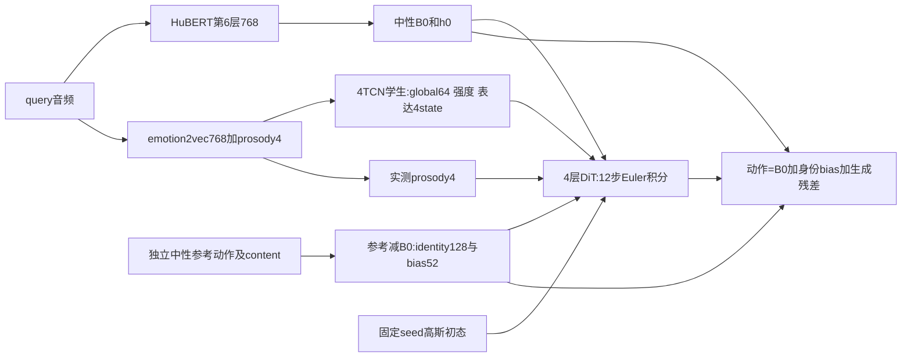

> 最新：Phase41内容条件表达响应已实施并开始首轮训练；实际层数、各阶段数据、梯度职责与旧模型区别见 [PHASE41_IMPLEMENTATION_AND_TRAINING.md](PHASE41_IMPLEMENTATION_AND_TRAINING.md)。以下描述仍作为历史基线；新候选尚未完成质量验收，默认模型不变。

# 当前模型与训练数据（2026-10-07，Phase39候选）

Phase39三seed训练/1367validation×三draw评分/原SHA备份/固定八视频已闭合，联合gate均失败，不采用。最终原128/64 F1 .616752/.548809、MBE .906927、LBE .450506，未超过Phase37/34总体门槛。报告收尾NameError已用独立原SHA恢复闭合，旧failed证据保留；模型训练代码未新增修改。Phase40只是待用户确认的架构/训练提案，未启动；发布默认未换，Phase26 native-GT B0/1540成绩不属于本架构成果。最新入口先读CURRENT_OPTIMIZATION_STATE.md。

## 数据与阶段职责

packed数据是MEAD原生音频、25fps原生时钟及52维动作系数；12536 TRAIN query/22位说话人/1372104有效帧；1367 validation query/3位说话人。sealed test未参与优化。

| 阶段 | 实际输入和监督数据 | 怎样训练 | Phase39状态 |
|---|---|---|---|
| B0口型 | HuBERT第6层768；715原生neutral和2583批准emotion→neutral配对 | 中性系数/相邻速度，使用原生观察与安全event/channel mask。嘴监督覆盖55.375%；297整段gate也受局部mask限制 | 冻结匹配的完整中性起点，没有改用情感GT |
| 身份 | TRAIN22人各2段独立中性参考动作及参考content；参考动作减自身B0 | 每段残差mean/std生成code128/bias52；互补参考静态均值预测+身份对比。validation由独立enrollment取得参考 | 冻结中性起点匹配的encoder/bias |
| motion teacher | 全12536 TRAIN原生GT减B0与身份bias；完整残差及相邻速度 | 历史阶段用8类情感/4级强度以及renderer任务学global64；原逐帧controls未蒸馏到当前学生 | 冻结；仅从TRAIN编码汇总情感×强度原型，不使用queryGT推理 |
| audio student | 全12536 TRAIN原生emotion2vec768+prosody4；自身眉眼GT与独立neutral anchors；TRAIN尺度；情感与强度标签 | 直接表达4state MSE+原emotion/intensity CE+TRAIN情感×强度global原型MSE；flow/generated目标不反传学生 | 三seed固定两轮已结束；HuBERT不直接进入学生 |
| residual renderer | 全12536原生GT；B0/h0、身份、学生global/强度/named ua和flow初态/时间 | 完整残差flow matching+原生成情感语义；条件detach后反传renderer；全部51观察通道，包括全部嘴部 | 三seed候选已结束；无硬嘴mask，无新critic/交换/ordinal |

TRAIN情感数按neutral/angry/contempt/disgust/fear/happy/sad/surprise：715/1671/1661/1729/1680/1707/1693/1680。强度：neutral=0、其他MEAD三级=1/2/3；它们是clip标签，不是逐帧GT。469可靠同人同情感同reference强度三元组jaw严格递增仅49.89%，未加入统一单调约束。

输入HuBERT来自hubert-base-ls960：12层Transformer/768D/12head，第6层缓存；emotion2vec_plus_base冻结特征取第2/4/6 block经逐帧LayerNorm后平均，与原生视频时钟对齐。四韵律为logF0（无声置0）/logRMS/periodicity/voiced，能量由波形归一化前计算。packed顺序为HuBERT768+emotion2vec768+prosody4，学生先只选最后772维，再使用TRAIN声学mean/std。

## 实际网络层数

| 模块 | 网络 |
|---|---|
| B0内容encoder | Linear768→192；4个残差TCN，kernel3/dilation1,2,4,8；2层Transformer encoder，192D/6head/FFN768；Linear192→128 |
| B0口型decoder | Linear128→192；3层Transformer，192D/6head/FFN768；Linear192→28再散射回52维；27个嘴/下颌加1个未观察通道 |
| B0局部跳接 | content LayerNorm；Conv768→256(kernel5)+GELU+Conv256→28(kernel1)，sigmoid gate加主decoder |
| 身份 | 残差mean52+std52→Linear104→192+SiLU+Linear192→128；bias Linear128→52、0.5tanh与观察支持 |
| motion teacher | residual52+velocity52→Linear104→96；3个masked TCN，dilation1,2,4；mean pooling→global64；8类/4级头 |
| audio student | Linear772→128；4个masked TCN，dilation1,2,4,8；mean pooling→global64与8类/4级头；已有Linear128→4状态头启用 |
| renderer | 4层192D/6head/FFN768 ResidualDiT；self attention、content/ua cross attention、global/intensity/time AdaLN和identity调制；52D速度输出 |

Phase39唯一新增Linear4→384（192个shift与192个scale，共1920参数），零初始化并保留RNG。只取named ua前4个预测表达状态，逐帧调制完整速度头的隐藏token；其余韵律仍通过原context进入。全部观察嘴通道继续由完整renderer生成，没有upper9接管、嘴mask或额外loss。config必须显式renderer_expression_modulation并匹配expression-prosody恢复；默认关闭。两真实step已确认旧named默认逐位重放Phase37、共同初始loss完全相同、第二step新参数有梯度、完整system保存恢复生成逐位一致。

当前named ua64：前4维raise/down/squint/wide有符号表达状态，经stride16固定线性spline；接着4维为标准化实测韵律；剩56维为0。旧local_head64仍保留检查点键，但候选不用它作时序条件。不是新增56个潜变量。真实4state来自原生眉眼GT相对独立neutral参考，不读取嘴GT，不把clip情感复制到每帧。

global64监督由冻结teacher的TRAIN情感×强度cell均值查表，8×4×64；同标签条件严格共享目标，不再逐clip拟合完整残差teacher code。缺失cell保留count0，不伪造有效目标。teacher仍看全残差，emotion2vec也未被证明完全无内容；当前目标限制不能等同完整因果解耦。

## 口型、情感与身份怎样配合

B0输入可以是任意情感音频，但学习中性发音目标。内容/h0供renderer控制原生音素时序。情感、强度、韵律和身份可调所有嘴通道的表达与幅度；结构不保证最终残差一定保持正确开闭时序，须用同原生时钟的jaw相关/速度与视频验证。

学生损失：`表达stateMSE + 0.1*(emotionCE+intensityCE) + 0.5*globalPrototypeMSE`。

renderer损失：`flowMSE + 0.2*(generatedEmotionCE + globalCosine + 0.1*generatedIntensityCE)`。生成项使用训练插值点可微端点，由冻结motion teacher读回；不是每次训练完整12步rollout。renderer条件全detach，因此此两项没有学生梯度。训练仍联合梯度裁剪；实际两update已检查其梯度责任、全嘴renderer梯度和冻结状态。

身份bias加静态动作偏置；code通过DiT调动态风格。参考来自动作及参考音频content，不能写成输入一张照片。固定rig呈现相同脸形，身份变化体现系数运动风格；换身份时不能拿原人的GT当异人重建真值。Phase37固定66cell/原三draw重放后的身份诊断已完成：异人code引起动作变化大于同人A/B参考，bias在raw域仅改变静态项。证明有响应，尚未证明风格正确。Phase38表达oracle显示接收器主要改善平均偏差，动态利用仍弱，因此实施Phase39单一调制实验。

身份训练代码复核：每位TRAIN说话人的独立neutral参考分成不重叠A/B；由A的code预测B残差均值、由B预测A，仅共同观察通道参与静态重建；总loss=该归一化双向MSE+0.05*style_contrastive（同人正样本、异人负样本）。身份阶段只更新identity_encoder/identity_bias，B0冻结；随后身份编码缓存detach，teacher/audio阶段renderer学习如何使用code，身份encoder/bias继续冻结。每个参考mean/std经MLP后等权平均，不按参考时长加权，也没有逐帧参考动作编码。当前能携带静态习惯和幅度统计，尚未证明特定人的动态风格被正确迁移。

## 推理与验证

噪声仅是flow初态，积分每步都有音频内容、表达、强度、韵律及身份条件。queryGT仅用于训练、评估或明确标注的oracle诊断；部署不输入queryGT/teacher。恢复必须读保存的audio_temporal_layout/stride并调用SlowStateAffect.from_checkpoint，不能按772维默认猜latent。

统一报告1367 validation×3seed×3draw，raw与clip_all同时保留，4个冻结motion probes、同rig几何误差、原生口型时序、配对speakerCI与固定八情感视频；不挑seed/视频，不做gain/retiming。F1是整段动作统计→冻结MLP分类，不是逐帧判别器；原128 probe在GT也只有.66034433，不能当唯一论文成功标准。MEDTalk/EmoTalk协议已核，DESTalker全文仍未核。

Phase34正确架构参考clip原F1 .683872/.581147、MBE .904603、LBE .446154、lip mean4.008668mm；Phase35/36/37均未通过联合gate。Phase37 F1 .617731/.549179、MBE .906694、嘴速度MSE .006339550，未达到SOTA。当前对比方法是同rig声明的共享音频改编，训练预算不完全相同，不能当官方端到端论文复现。

历史全文已保存在archive/CURRENT_MODEL_AND_TRAINING_before_phase37_20261007.md；原阶段native-GT/1540实验只作历史，不作为当前成果。
