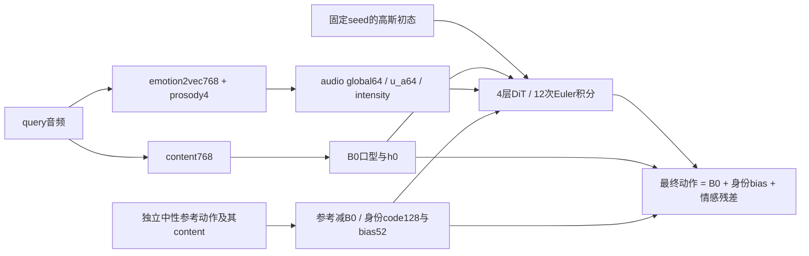

# 当前模型与实际训练数据（2026-10-07）

最新覆盖：Phase36已完整闭合且三gate失败，拒绝。Phase37为尚未训练的候选：学生4表达状态+4实测韵律的named ua，TRAIN情感×强度global原型；renderer全残差条件detach，学生直接表达状态/原CE/globalMSE训练。层数、全嘴前向、中性B0/身份/旧teacher冻结不变，无新神经层。下方Phase36活动状态属于历史，实时状态只看CURRENT_OPTIMIZATION_STATE.md。

最新覆盖：Phase34、35训练/完整评分/全SHA备份均COMPLETE且联合门槛拒绝；Phase36表达梯度职责试验ACTIVE。三seed47/48/49各两轮，复用Phase34 standardized对照，只更新772学生和renderer。候选把学生flow/generated-semantic梯度限制到9个原生眉眼通道，renderer保留完整原目标及全嘴前向；没有新增层/loss。旧global教师仍读全残差，没有新逐帧表达teacher，不能称完全解耦。实时状态只看CURRENT_OPTIMIZATION_STATE.md/PHASE36_EXPRESSION_GRADIENT_PLAN.md；下文旧“正在进行/等待批准/native当前”都是历史。

全2,583条配对的只读审计已完成：实际嘴部监督覆盖55.375%，所有event mask都是0/1；297整段gate通过的clip也受提供的局部mask限制。原artifact dtw_quality_verified=false与后续manifest多路审计分别解释，不将配对差宣称纯情感GT。详见EXPRESSION_TARGET_AUDIT_20261007.md。

压缩后先读 `CURRENT_OPTIMIZATION_STATE.md`；本页说明真实运行实现，不把旧类名、默认 CLI 参数或未启用模块当成实验事实。

最新用户决定：保持B0中性，暂停Git上传。Phase32三seed两轮D1已全部完成：旧默认完整中性坐标起点，对比legacy1540与affect772，B0/identity/teacher冻结，只训练audio/renderer；不混拼native权重或TRAIN坐标，不改loss。全部评估/419文件SHA下载及Happy/Neutral视频闭合，联合门槛失败，不推广。当前Phase33只冻结提取TRAIN通道统计/global泛化并重验772的u_a/identity；实时停止点见`CURRENT_OPTIMIZATION_STATE.md`，不要用下方历史native表作为新模型训练事实。

最新架构纠偏：Phase26/29历史student为1540D，包含HuBERT。新候选student只读emotion2vec768+prosody4=772，HuBERT保留在B0/h0内容路；真实两update验证其HuBERT梯度为0、修改HuBERT列不影响global/u_a。Phase32已闭合clip原生成F1 .173692/.236896、MBE .915546，不能使用历史F1冒充。u_a仍由全残差flow间接监督，没有新的逐帧纯情感teacher目标；输入已隔离不等于表达/内容已完全解耦。详见EMOTION_STUDENT_INPUT_CORRECTION.md。

## 当前中性模型：阶段分工与数据

| 阶段 | 实际数据/输入 | 训练职责 | 当前Phase36是否更新 |
|---|---|---|---|
| B0口型 | HuBERT第6层768；715原生中性anchor＋2583批准的情感音频→中性teacher配对（297完整mouth gate、2286局部监督mask） | 中性发音与原生音素时钟；同步中性目标及相邻帧速度监督 | 冻结完整旧中性B0；没有重新训练 |
| 身份 | 22位TRAIN说话人各2段独立中性参考；参考动作减对应B0 | mean/std→code128与bias52；互补参考静态均值预测＋身份对比；code调动态、bias加静态 | 冻结与中性B0匹配的encoder/bias；validation用独立enrollment |
| motion teacher | 全12536 TRAIN原生GT减中性B0和身份bias；读取残差及相邻速度 | global64、8类情感、4级强度；旧teacher阶段曾联合训练audio的u_a和renderer，未使用teacher逐帧control蒸馏u_a | 冻结已有teacher，不混入native teacher |
| audio student＋renderer | 全12536 TRAIN原生音频/同步GT；学生emotion2vec768＋prosody4，HuBERT只供B0/h0；身份取独立参考 | 学生global蒸馏＋情感/强度CE，flow/generated-semantic反传仅9个眉眼表达通道；renderer仍完整残差；u_a64仍间接监督；全嘴开放 | 三seed47/48/49各2轮1568updates，新学生/renderer更新；复用Phase34三个772 standardized对照；TRAIN diagonal source/mean/std及coordinate误差；仅学生梯度职责变更 |

该表说明当前中性训练链的职责；历史阶段的精确总预算不由Phase32两轮推算。新候选没有增加网络层：B0是4TCN＋2层encoder/3层decoderTransformer，学生4maskedTCN，teacher3maskedTCN，renderer4层192D/6head DiT。情感和身份能改变嘴幅度与姿态；原生时序正确性需独立验证，不能由结构名称保证。

## 1. 哪个模型是“当前模型”

- 默认发布权重仍为 `phase2_fullmouth_timing000_20261004/audio/final.pt`，尚未被候选替换。
- 满足中性B0和772输入的最新完整基线是Phase32 affect772，两轮/三seed；未接纳，见PHASE32_RESULTS.md。Phase26 stable `train-standardized` 固定12轮仅为历史偏离分工的对照：native-GT B0 + 重新适配身份/teacher/audio + TRAIN通道坐标的DiT输出头重新拟合。其三seed审计/下载均完成，但不能作为正确架构成果。
- Phase26 原失败保留；统一后端后的六臂前1568更新全state及真实流严格闭合，全部固定12轮9408updates完成。最新clip原generated128/64 F1=.796875/.721358（各seed两probe都>.7），raw=.619331/.591701；MBE=.870982/LBE=.421170，中性jaw及联合gate未通过。Phase27/28定位连续global的未见speaker泛化问题。Phase29 p=.1 dropout已完成：clip F1=.797647/.715031，MBE=.864415/LBE=.420868，嘴部位移误差反升3.47%，三联合gate均失败，不接纳，不继续扫描。恢复入口见 CURRENT_OPTIMIZATION_STATE.md；后续待批准方案见 NEXT_DISENTANGLEMENT_AND_IDENTITY_PLAN.md。

Phase25 完整 validation、三 seed、三 draw、clip_all 均值：

| 指标 | 匹配 centered control | standardized 候选 |
|---|---:|---:|
| MBE | 0.873153 | 0.855830 |
| LBE | 0.419426 | 0.416625 |
| 最终生成动作独立 F1（原128） | 0.272033 | 0.778258 |
| 最终生成动作独立 F1（原64） | 0.286390 | 0.665628 |
| 辅助 stable F1（128 / 64） | 0.414684 / 0.337615 | 0.791925 / 0.749272 |
| 嘴部位移 MSE | 0.002202119 | 0.002201256 |
| jaw centered correlation | 0.321086 | 0.307054 |

原64 F1、MBE 尚未达到目标；三个 seed 的中性 jaw 时序都变差，联合门槛未过，因此没有推广或 SOTA 结论。F1 是最终生成动作分数；音频头约0.85的 F1、辅助 probe、GT-informed oracle 不是同一个指标。MBE/LBE 沿用本项目原协议定义；本轮尚未补算新的 mesh LVE 等论文全部指标。

## 2. 数据到底是什么

真实输入目录：`/root/autodl-tmp/kinetalk_data/packed_trainval_20260923`。数据是 MEAD 的原生音频及其对应52维动作系数，25fps，全长序列；batch 仅去掉多余 padding，缺失帧/通道不计入监督。

| 用途 | 实际规模与边界 |
|---|---|
| TRAIN query | 12,536段，1,372,104个有效原生帧，**22位**说话人 |
| validation query | 1,367段，3位未参与训练的说话人 |
| 身份参考 | 同人独立中性 utterance，与 query 的句子分离；TRAIN每人2段，形成22个互补参考对 |
| test | sealed，当前优化不读取其成绩或目标 |
| 情感标签 | neutral、angry、contempt、disgust、fear、happy、sad、surprise |
| 强度标签 | neutral=0，其他7类的 MEAD level1/2/3=1/2/3；没有把三级丢掉 |

TRAIN说话人ID：`0–8,10–15,18–24`，共22个；validation：`9,16,17`。以前摘要称24位训练说话人是计数错误，以真实 provenance 为准。

TRAIN各情感 query 数：715 / 1671 / 1661 / 1729 / 1680 / 1707 / 1693 / 1680，按上述8类顺序。身份的22对来自22位各2个中性参考，12轮、batch2=132次更新；不能把12,536个query算成身份训练样本。

音频输入有两条：

- B0：768维原生 content 缓存，已核验来自checkpoint `/root/autodl-tmp/models/hubert-base-ls960` 的 HuBERTModel **第6层**，16kHz波形、无padding；base结构12层Transformer、hidden768、12head、FFN3072。原生clip的 `hubert_recipe` 与实际提取recipe的规范JSON SHA逐位相符（c72f847…f7ff3c），不是仅凭维数推断。未登记上游revision时不补造revision。
- 当前音频情感学生：772维 = emotion2vec768＋prosody4；legacy匹配对照/历史模型另含HuBERT768，合计1540。emotion2vec固定取第2/4/6 block，经逐帧 LayerNorm 后平均，并对齐原生视频时钟；prosody 是 log F0（无声置0）、log RMS、周期性、voiced标记。全句波形归一化用于emotion2vec，能量由归一化前波形计算。

音频缓存float16，batch读取时转float32。特征 mean/std 与通道统计只在完整 TRAIN 有效帧拟合；预训练内容/emotion2vec提取器冻结。旧配置的 `data.audio_dim=83` 是历史模块维数；packed缓存仍1540维，当前学生在归一化前只选择末772维。

emotion2vec实际checkpoint为 `iic/emotion2vec_plus_base` 的本地master snapshot，权重SHA60710b5a…aadbd、约93.18M参数；config记录audio prenet_depth4、shared depth8、hidden768、12heads，提取时冻结。完整source证据保存在当前Phase26 stable目录的audio_source_audit.json。

高质量配对的用途须分清：默认历史 B0 的跨情感 neutral-teacher 监督只用安全 DTW 配对和局部观察 mask；最新 native-GT B0 直接使用每段音频自己的同步 GT，没有跨情感重配对。身份只要求同人独立中性参考；teacher/audio 学习也使用每段自身动作。不能把“不需要跨情感配对”和“所有原生 GT 已人工证明高质量”混为一谈。

## 3. 四阶段：真实输入、监督和冻结关系

下表仅为Phase19–29历史native候选训练链，保留作实验记录；当前中性Phase32以页首表和binding为准。

| 阶段 | 输入/训练数据 | 输出与训练方式 | 已完成预算 |
|---|---|---|---|
| 1：口型 B0（Phase19） | 全12,536 TRAIN音频content + 各自nativeGT，所有情感/三级强度 | 仅训练Stage1；监督嘴/下颌输出，以TRAIN通道尺度归一的Huber + 0.1相邻帧速度Huber | 2轮，batch16，1568更新 |
| 2：身份（Phase21） | 22对同人、异句中性参考；动作先减当前B0 | 训练identity encoder/bias；互补参考之间对称静态均值预测 + 0.05身份对比；B0冻结 | 12轮，batch2，132更新 |
| 3：motion teacher（Phase21） | 全TRAIN同步audio + nativeGT；GT减B0与身份bias后的残差 | teacher提供全局情感/强度；音频学生提供同步逐帧u_a；联合训练teacher、audio和renderer；B0/identity冻结 | 2轮，batch16，1568更新 |
| 4：audio student（Phase21） | 全TRAIN音频；训练时冻结teacher提供残差全局蒸馏目标 | 音频预测global、u_a和强度，训练audio与renderer；teacher/B0/identity冻结 | 2轮，batch16，1568更新 |
| 4的坐标重新拟合（Phase25） | 相同TRAIN、相同warm输入/统计；不改变支持或条件 | 两臂共同清零renderer输出头一次；候选用通道坐标与对应flow误差单位；其余损失相同 | 2轮，batch16，1568更新 |
| 4的固定预算验证（Phase26 stable） | 与Phase25相同起点，统一固定GPU后端；独立建立每臂两轮基线后重新从第1步训练十二轮 | 前1568更新全部state/样本/GT/mask/noise逐位等于对应新stable两轮基线；随后持续到固定final12，不在第2轮再次清头 | **全部六臂12轮、每臂9408更新完成** |
| 4的global泛化候选（Phase29） | 同Phase26 standardized12起点、TRAIN、源统计及预算 | 仅训练调用的pooled128读出加p=.1 dropout；私有CPU RNG，部署关闭；teacher/B0/identity冻结，audio/renderer更新 | **三seed固定12轮及全评估完成；未接纳；492文件下载SHA核验完成** |

Phase25的 provenance 中 `articulation_scope=neutral` 是 audio-only 调用的未执行默认参数。其B0实际来自Phase19的 `all-emotions` 训练，不能据这个字段误称候选只训练了715段中性。

## 4. 网络结构和层数

| 模块 | 实际结构 |
|---|---|
| B0内容编码器 | Linear768→192；**4个残差TCN块**（kernel3，dilation1/2/4/8，各含GLU、GroupNorm、SiLU、1×1Conv）；位置编码；**2层Transformer encoder**（192隐藏、6head、FFN768）；LayerNorm；Linear192→128 |
| B0口型解码器 | Linear128→192；位置编码；**3层Transformer encoder**（192隐藏、6head、FFN768）；Linear192→28个输出，再散射回52维。28个为27个嘴/下颌系数加1个未观察通道；非嘴B0为0 |
| B0局部跳接 | 原始content LayerNorm；Conv768→256(kernel5) + GELU + Conv256→28(kernel1)，sigmoid gate加到主解码器；不是另一个情感网络 |
| 身份encoder | 每个参考残差的52维mean及52维std拼104维；Linear104→192 + SiLU + Linear192→128；多个有效参考等权合并 |
| 身份bias | Linear128→52；`0.5*tanh`限幅，再按观察支持过滤；另将128维code作为DiT风格条件 |
| motion teacher | 输入52维残差 + 52维相邻速度；Linear104→96；**3个masked TCN块**（kernel3，dilation1/2/4）；有效帧mean pooling；Linear96→64 global；8类emotion与4类intensity线性头 |
| teacher历史低频头 | rank8、stride4的controls仍保留在checkpoint；当前renderer时序来自audio的u_a，不使用teacher逐帧controls作部署条件 |
| 实际audio学生 SlowStateAffect | 当前候选TRAIN标准化772维，Linear772→128（历史/匹配对照1540→128）；**4个masked TCN块**（LayerNorm/SiLU/Conv，dilation1/2/4/8）；mean pooling + Linear128→64 global；8类/4级头；逐帧Linear128→64产生u_a |
| 残差renderer | 条件rectified flow的**4层ResidualDiT，192隐藏、6head、FFN768**。每块有自注意力、对content/u_a的交叉注意力、MLP，以及global/intensity/time的AdaLN调制和identity/style调制；线性52维速度输出 |

Phase26完成模型dropout=0。Phase29仅pooled-global读出训练时p=.1，不改变层数或state keys，u_a仍从原hidden序列计算；其共享TCN训练更新仍可能间接改变u_a。Stage1保留native context9接口，但4D窗口输入只选择中心帧；它不是9层网络或可学习对齐注意力。实际Stage1末端为默认linear输出，最终报告同时给raw与clip_all（完整输出裁剪[0,1]）政策；不要把评估裁剪写成训练使用sigmoid输出。

残差物理尺度0.25；content latent128、global emotion64、u_a64、identity128。全51个已观察通道均允许残差生成，**jawOpen、嘴唇张合、smile/frown均开放**；第52通道（索引51）未观察而关闭。当前无额外temporal adapter、output projection或Stage5；`system.audio_encoder`和旧四个slow-state头不是这条部署路径。

## 5. 口型、情感、身份各自怎么学

2026-10-06 teacher/u_a澄清：teacher编码器读取GT残差整段序列及相邻速度，不读取音频u_a；它生成global/intensity，旧controls不作为当前renderer时序条件。teacher阶段实际联合更新motion_teacher、audio学生与renderer，merge_teacher_audio使用teacher global/强度及audio原生逐帧u_a；此阶段没有global蒸馏，也没有teacher→student逐帧控制蒸馏。audio阶段冻结teacher，只蒸馏其global；u_a在两个阶段均通过逐帧GT残差flow目标及生成语义项反传学习。teacher阶段audio的global分类头不作为该阶段语义源。正确路由/梯度/输入时钟检查不等于u_a具有正确时序作用；最新模型还须固定global/强度/内容/身份/noise后对u_a做zero/static/reverse/shuffle消融。最终jaw时序差只能说明整条残差路径有问题，尚不能单独归因u_a，不能直接加逐帧蒸馏loss或门控。用户要求先解释，当前无新训练/代码修改。

**口型**：当前B0按中性目标学习发音，输入可以是情感音频；训练监督来自715中性anchor与2583安全情感→中性配对。Phase19–29 native候选曾用原生情感GT，只作历史对照。残差可调节所有嘴通道，情感/风格能影响大小。没有硬口型保护或完全解耦保证；全嘴范围接近GT不等于时序正确，统一放大不能解决中性jaw错时序。

**身份**：中性参考动作减B0，统计稳定偏置与变化，学128维code及52维静态bias。两段参考互相预测对方残差mean，并通过对比学习区分说话人。bias同时参与最终加法，code参与renderer调制。身份表示是系数/运动风格，不是从照片恢复脸形、纹理或真实3D几何身份。

**情感**：teacher看真实动作残差，学64维全局情感；audio学生从音频学同坐标global、强度及逐帧u_a。用户要求u_a只表达情感/韵律动态；目前仍是全残差间接监督，没有逐帧情感教师目标，不能称已完成解耦。新772D路径去掉直接HuBERT入口，Phase32正在匹配迁移训练，监督不变。强度通过4类CE及概率期望标量 `sum(p(level)*level)` 调制DiT；它不是已学习好的三级口型单调控制器。当前ordinal mouth权重=0，未加VA标注或单调强制。

真实audio阶段loss：

`flow + 0.1*(emotionCE + intensityCE) + 0.5*globalMSE + 0.2*(generatedEmotionCE + globalCosine + 0.1*generatedIntensityCE)`。

generated项用训练插值点上的可微端点估计，交给motion teacher读回；不是每一步训练都完整rollout12步。独立评分probe没有反向训练renderer；class_balance_power=0，实际也未启用类别平衡。endpoint、content_timing、ordinal、independent_probe、motion_statistics等额外权重均0。

Phase25的核心变化是统一模型坐标：`y=(x_t-t*mu)/s`，物理速度 `v=mu+s*network(y,t,conditions)`；mu/s只来自完整TRAIN残差。匹配control也中心化但s=1；候选按通道std归一，flow误差使用同一单位。两臂物理噪声源与初始平均速度相同，没有新增loss项。近恒定通道原来精度严重失真，该改动同时改善其精度及两组独立F1；但几何/时序没有全部达标。

## 6. 推理输入和输出

query GT只用于训练/评估及明确标识的oracle诊断，部署不输入queryGT或motion teacher。参考是中性动作系数及其content缓存，不能误写成只需一张静态人脸图片。噪声是flow积分初态，之后每一步都受content、音频情感、身份条件控制，“从噪声出发”并不表示无条件生成。

## 7. 可复核证据与继续顺序

- 本地真实配置/权重/recipe：`final_experiment/evaluation/diagnostics/phase25_channel_coordinates_20261006/seed47/checkpoints/standardized/{provenance.json,audio/final.pt}`。
- B0训练事实：`phase19_native_b0_target_20261005/seed47/native/provenance.json`；身份及teacher/audio适配：`phase21_native_b0_adaptation_20261005`。
- 源码：`models/model.py::Stage1Model`、`models/encoders.py`、`models/neutral_affect.py`、`models/slow_state_affect.py::SlowStateAffect`、`models/dit.py`（均在kinetalk_b0内）；`scripts/train_full_staged.py`及特征准备脚本。
- 当前Phase26 stable prereg：`final_experiment/evaluation/diagnostics/phase26_channel_coordinates_stable_budget_20261006/preregistration.json`；旧失败登记和诊断完整保留。observer7项本地核验通过，固定后端两次真实1568更新重放已逐位一致。
- 独立source/inputs/probes/stats已绑定，完整Phase25归档已验证回收，新stable两轮/十二轮对照及全1367validation×3draw完整审计已完成，不选seed或epoch。十二轮standardized最终clip生成原F1=.796875/.721358，三seed各自两probe均>.7；raw=.619331/.591701。MBE=.870982/LBE=.421170，中性jaw时序及联合gate仍不通过，未推广默认；结果见PHASE26_FINAL12_RESULTS.md。
- Phase27/28已完成：GT-global定位MBE=.632573，不能当部署成绩；TRAIN→validation连续global误差增15–16倍。Phase29完整结果及中性jaw分解已完成，dropout拒绝，默认未推广。当前成果已推GitHub，下一步先按NEXT_DISENTANGLEMENT_AND_IDENTITY_PLAN.md讨论，得到用户同意后再实施冻结身份/u_a诊断及772D匹配迁移；本輪无新训练。论文SOTA还需同协议、同split/身份参考/数据预算的对比方法、sealed最终评估和视觉结果。
