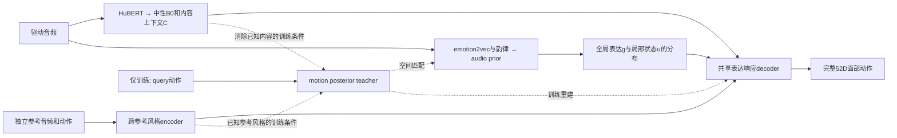

# 新架构研究方案：中性发音、条件表达响应、跨参考风格

2026-10-07，proposal_v2，**仅供审阅，未实施**。取代旧PHASE40_ARCHITECTURE_PROPOSAL作为讨论稿；旧方案和失败实验保留，不覆盖证据。文献依据见LITERATURE_SYNTHESIS.md。本文中的效果均为待检验假设，不能预称最优或SOTA。

## 1. 推荐决定与旧方案的区别

推荐研究**内容条件下的表达响应模型**：B0负责中性发音；音频表达支预测连续的表达状态及其不确定性；参考支学习可跨句转移的说话习惯；一个共享decoder把当前发音、表达和风格组合成完整面部动作。

与旧方案相比，关键不在把4维换成32维，而在三项改变：

1. **教师与学生的表达空间一起建立。** 用motion posterior与audio prior的匹配约束，使teacher不再自由编码任意残差之后才要求student复刻。先验允许对音频不能唯一确定的动作给出分布。
2. **身份学“对不同发音/情感的响应习惯”。** 用不同参考片段预测独立query，替换只重建neutral残差均值的目标。静态bias保留为可解释子项，动态风格必须有跨句收益。
3. **decoder显式接收当前内容，但student不接内容。** 情感可以改变当前音素的嘴形幅度与情感形变，不通过重新生成一整条独立的嘴运动时间线来纠错。

第一阶段验证一个确定的音频输出和posterior重建；只有mean路径、因素干预通过后，才评价随机样本是否增加合理变异。不会再从完整52D随机初态flow开始同时修口型、情感、风格。条件VAE本身已有先例；此选择是研究方案，不是原创性结论。

## 2. 先把四个概念定义清楚

| 因素 | 本项目操作定义 | 不应混入的职责 |
|---|---|---|
| 内容C | 驱动音频的音素/viseme及其顺序、时长、协同发音上下文；B0给中性发音轨迹 | 不承担情感标签监督，不换成情感GT的B0 |
| 表达E | 类别/强度相关的整体状态＋局部表达动态；包含情感、重音相关的表达调制 | 不编码另一句内容，不负责弥补B0系统性发音错误；**不是所有E都能准确由音频预测** |
| 风格S | 一个说话人在多句中相对稳定的发音幅度、口唇动作习惯、眉眼响应倾向；可以调节情感表达方式 | 不是某一段参考的逐帧动作；不是脸形、纹理；speaker ID只能当训练分组元数据 |
| 几何身份β | 中性脸形/rig几何 | 当前固定rig没有β泛化证据，不能声称换参考改变长相 |

情感与风格不必在输出上相加独立：同样happy，不同人笑的幅度、持续时间、眉眼联动可不同。我们要求输入因素可单独改变、内容可保持，而不是要求真实世界中这些量统计独立。韵律与音素相关本身不是“泄漏”；直接把HuBERT灌入情感student仍不采用。

**两段neutral参考只能较可靠地支持neutral发音习惯。** 它们不能唯一辨识一个未见人愤怒或大笑时的个人风格。保留两neutral参考作为受限协议；若要论文主张个性化情感响应，应另建独立的mixed-emotion enrollment协议，参考不与query重叠，报告neutral-only与mixed-reference两种信息预算。不能偷偷增加参考后与旧两段neutral方法比较。

## 3. 建议的模型及信息流

### 3.1 内容支：保留职责，单独评估是否需要重训

沿用HuBERT→B0/h0的中性接口。native neutral和批准emotion→neutral监督保持隔离；不会让情感query GT的完整重建loss更新B0。现有715 native neutral＋2583批准pair仍是中性监督来源；pair安全mask只限制监督，不限制嘴输出。

B0必须单独通过held-out native-neutral与安全neutralization测试。如果口型事件/闭合本身错，先修内容支：训练数据质量、音频时钟、可用上下文、收敛；有证据才尝试更强phonetic表示/内容侧Wav2Sem。不能让表达空间替它补错。临时换成GT中性轨迹只作oracle定位，不报部署成绩。

还要检查一个隐藏捷径：**B0输出中性，不代表其h0隐变量只含内容。** 初版C以B0预测轨迹及原生邻域为最小输入；h0作为单独消融，只有提高音素可读性且通过换情感/neutralization检查后才接入。若需要更强内容表示，另行审阅有音素监督的紧凑内容瓶颈；不能把未经核验h0直接接入D，再称情感必然只由E控制。图中的内容上下文是经此验收的C，不默认等于完整h0。

### 3.2 表达空间：可重建，也受音频可预测性约束

设motion posterior为`qφ(g,u | Y,C,S)`，audio prior为`pθ(g,u | emotion2vec,prosody)`。g表示clip整体表达，u为时序状态；它们属于同一个分层表示，替换现有固定class×intensity原型和四state监督。类别与MEAD三级强度是g的弱语义监督；**不能把clip标签复制成u的每帧真值，也不要求jaw对三级严格单调。**

q可以在训练中观察动作，并以已知C/S为条件解释哪些变化尚需由表达承担。p不读取C、HuBERT、queryGT、动作teacher输出或目标speaker的query数据；部署只使用p和独立参考S。q不是“纯情感真值生成器”：任何可逆的latent重编码、B0误差与真实表达都可能混淆，必须接受下面的干预验收。

初始实现候选：q用3层masked TCN＋2层时序attention，hidden128；p用4层masked TCN＋2层attention，hidden128；g取32D，u从16D开始；u每2个25fps帧一个token再解码回原生时钟，不沿用stride16。维度/stride仅是可执行起点，**不是由文献证明的最佳值**。通过TRAIN内部的重建–prior预测折衷曲线只做有限容量对照（例如u=8/16/32，先单seed开发），选择最小充分表示；若stride2丢失事件则回到逐帧，不能用“情感都低频”掩盖损失。

p/q输出序列latent的均值与对角方差，序列依赖由时序encoder/decoder表达。对角高斯未必覆盖复杂多模态；若分布检验表明不够，再提latent flow或离散codebook替换，**首版不同时加VQ、flow和diffusion**。噪声只在表达latent采样，不能据此宣称嘴时序已经受保护。

g的CE不会强迫同类同强度所有片段拥有完全相同向量；u保留片段内变化。global/local分解也不是天然可辨识：通过固定g、静态/反转u，以及固定u、交换g验证职责；出现互相代偿则收缩为一个表达序列表示，而不是再加约束维持漂亮结构。

### 3.3 风格支：用跨参考预测替代身份标签记忆

对每个参考片段输入其native动作、参考自身B0和可观测mask；参考音频内容只用于解释参考发音，**没有参考时序token传到query decoder**。候选用3层TCN(hidden128)提取局部运动关系，再masked pooling成64D code；多参考经同一集合聚合器汇总。输出静态bias和同一全局style code，供decoder调制。

训练按speaker采样support/query：support与query为不同录音、尽量不同句；两组独立support预测同一query。训练目标是query真实动作预测，参考集合改变而query内容/表达固定，模型必须学习可复用风格才能持续降低误差。不要先冻结一个仅预测均值的style encoder，再希望后续renderer自动让它懂动态。

首版不新增身份分类器/GRL/style contrastive堆叠，先靠参考设计与跨query重建建立风格作用。若模型忽略S，先验收数据支持和有效变化，不以异人差异大当成功。若用了mixed-emotion参考，必须按emotion/句子控制采样，检验S是否偷偷携带参考情绪；无法分离时将它诚实定义为“参考表演风格”，不能继续称独立身份。

### 3.4 共享decoder：内容条件的表达响应

建议以4个hidden192的时序残差块编码query内容上下文，表达/风格在各块调制隐藏状态，最终输出完整52D系数；没有独立的情感嘴时间线，没有时间warp，没有嘴通道排除。可以复用现有192D容量做公平对照；不沿用全残差DiT的noise/time输入和反复积分。

概念式：`Y_t = B0(C)_t + b(S) + R(C_neighborhood(t), g, u_t, S)`。

R是内容条件下的表达与风格响应，输出所有观察通道；例如同样的happy可以对当前开口音扩大张口，同时保持闭唇音仍可闭合。不是手写固定正gain乘B0＋任意慢offset，也不把内容限定为B0数值本身，以免无法表达正确的情感嘴形。

**这条式子只固定输入时钟，不保证峰值、闭合和内容自动正确。** 因此要求共享decoder的表达输入对嘴有有效梯度，并通过中性边界、可信pair交换和独立lip事件测试；失败时不能只强调“结构上没有重采样”。

## 4. 训练目标与梯度责任：最多三类目标

初版保留三类有明确定义的目标，不再用当前teacher对生成动作的自我评分驱动优化：

1. **动作似然/重建**：对native query完整观察动作的重建，包含位置及真实相邻速度；它也用于support→query和可信pair交换，不另造一串相似loss。位置项优先沿用TRAIN归一化的系数误差；mesh辅助只有证据表明系数权重误导几何时才替换/增加，不两套默认叠加。
2. **posterior–prior匹配**：`KL(qφ(g,u|Y,C,S) || pθ(g,u|A_E)))`，促使teacher保留音频支能够支持的表达分布，同时让student匹配其条件分布。连续latent的方差需下限、有限值和校准检查；禁止靠无限增大方差掩盖错误。
3. **弱语义锚定**：g的emotion/intensity标签监督。强度仅clip级；不新增通用嘴幅度单调、多个生成critic、所有空间正交或无条件GRL。

训练重建使用q采样，故完整query动作重建梯度更新q、D和S，**不通过采样路径更新audio prior p**；p通过KL和情感/强度学习，HuBERT/B0维持冻结。q与p的KL联合更新形成配合，避免teacher预先冻结任意空间；这是一种条件变分建模思路，加入交换、速度等实际训练项后，不把总loss冒充严格的单一ELBO。

训练到后期加入p条件供decoder适应真实部署分布：此时p输出detach，只更新D/S，动作重建不会反传p。q路径和p路径使用同一个decoder，报告二者误差差距；这项调度先固定，再做消融，不能一边换条件一边换损失权重挑dev最好结果。

不可避免的风险：KL可能压掉有用表达或发生posterior collapse；p的emotion2vec也可能携带内容；D可能忽略u、S或利用g记忆。先检查这些机制，而不是再加loss。只有当现有三类目标不足、且有明确失败证据时，才提一个有作用定义的修正。

每段音频只有一个观测动作，无法仅凭单样本残差把模型误差、伪GT噪声和真正的一对多变异完全分开。p的方差只能先称“模型条件预测不确定性”，必须检验held-out覆盖、校准和错误扰动，不能直接称真实人类情感不确定性。分布匹配采用每个有效latent维/时刻归一化，避免视频长度改变KL权重；多参考训练不得让q访问support以外的同人query来构造S。

## 5. 配对交换的合法使用

仅使用原manifest中批准的同人同句emotion↔neutral对，并逐帧逐通道使用安全mask。原生自身重建不要求cross-pair；交换重建才要求对应关系。

两种有效操作：保持情感片段C和S、换入neutral表达，在批准对齐位置检查neutralization；保持对齐后的neutral内容与S、换入情感表达，在相同可信位置检查情感嘴形/幅度。时钟映射必须沿已有配对记录，不能靠整段插值假装音素对齐。每个训练batch记录有效监督覆盖。

任意跨人/跨句换情感并不存在精确逐帧GT。可以用来做内容保持和语义干预评价，但不能无条件给一个“交换后的真值”或宣称cycle自洽证明语义正确。MEDTalk的synthetic strict pairs仅是可选对照，不能替代真实数据并把合成教师当最终真值。

## 6. 验收矩阵：先证架构职责，再谈提高分数

| 检查 | 有效成功证据 | 失败说明／下一步 |
|---|---|---|
| B0中性职责 | native-neutral口型准确；不同情感音频neutralization后仍中性，音素顺序保持 | B0错则先修B0；不让情感teacher补发音误差 |
| posterior重建 | 完整GT表达能通过D改善几何与动态，嘴事件无新增错乱 | q/D容量、目标或数据存在问题；不扩大audio训练掩盖 |
| audio可预测性 | p优于class/intensity-only、temporal-static基线；同类同强度内，正确音频比错配音频更好 | 类别识别代替动态预测，或音频条件弱；检查错配/时间对齐，不能声称已学ua |
| 动态接收 | 真实/预测u优于static、reverse、shuffle，尤其event/centered-corr | 仅均值或幅度作用；不能把FDD/情感F1改进当时间建模成功 |
| 解耦 | 固定C换g/u：表达变化、内容读出与时机可接受；固定表达换C：发音随C | 学到了内容捷径；按可靠pair与非情感错误定位，不强制全部线性相关为零 |
| 参考风格 | 同人独立参考稳定，异人切换向目标人的held-out风格分布靠近，内容不被参考句覆盖 | 只分类ID、只改静态偏置或style被忽略；不能靠t-SNE验收 |
| 随机性 | latent采样改善条件分布/人评，mean路径及关键嘴事件不退化 | 不需要或噪声太大；保留确定路径，删除无收益随机分支 |
| 学术增益 | 统一预算基线＋3训练seed＋固定draw，联合准确/动态/语义改善 | 无可靠收益则回退，不因结构“看起来学术”继续加模块 |

内容读出probe需独立TRAIN训练，报告原始audio/GT/B0/生成参考分数，避免“把probe也训差→显得更解耦”。有标签相关性时按speaker/emotion/intensity分层；emotion不应完全去掉prosody。未见句、未见身份要分别评估；同一speaker的不同clip不当成独立身份实验单位。

## 7. 实验推进顺序与资源原则

**本轮仅文档。实施前由用户确认以下研究方向，再给精确配置和数据清单；没有自动批准训练。**

### R0：低成本证据补齐

先做TRAIN内按speaker/句子划分的development folds；检查native GT与原视频的表情/音频时钟、配对事件和独立参考污染；重新确认B0错误的占比。建立指标扰动校验：GT原序、static、reverse、shift、均匀gain，验证每个指标对其声称问题敏感。MBE/F1历史定义不改。

### R1：内容条件decoder与表达表示小样本可学习性

先固定B0与现有S，对比相同数据、相近容量的旧flow与新确定decoder；同时比较四state与新q表示。小样本能否拟合、梯度/冻结/恢复/时钟/全嘴通道先通过。此阶段是oracle诊断，不算音频部署结果。

### R2：teacher–student联合空间

对比“先训q后固定蒸馏”和“q/p共同约束空间”，decoder与数据相同；再比较点表示与概率表示。只有真实音频输出改善、没有内容捷径才保留。不能因oracle优秀就跳过这道门槛。

### R3：跨参考风格与情感交互

与mean/std原style、speaker one-hot训练人基线比较；先两neutral参考协议，再单列mixed-emotion参考。用同query/情感/随机seed换参考的视频和定量检查，不只展示某一个人张嘴更大。

### R4：收敛、公平复现与论文主结果

筛选时可用单seed TRAIN内部小任务；正式候选固定3训练seed，随机模型固定draw，各算法采用同数据同信息预算。新架构不能一律只训2轮就作最终结论：基于TRAIN内部曲线预先确定收敛/预算规则，同时报告等update与合理收敛两种对照、训练成本。以前短pilot失败仍有效，但只能证明该预算下无收益。

正式对照优先覆盖EmoTalk、DEEPTalk或ExpTalk、MEDTalk（具备可用代码/可重建协议时）及Mimic/DiffPoseTalk风格路线；公开承认同rig改编与官方实现区别，保留强简单基线。若要与公开论文主表比较，还需在其公开3D benchmark按官方split复现，不能只用本MEAD52D的内部改编结果宣称领域SOTA。

最终再冻结模型、所有阈值和论文主表，在sealed test/外部集验证。反复使用的现有1367 validation不得假装最终未见测试。F1≥.7、MBE≤.7仍可列项目愿望，但**不是可保证的学术验收条件**；以同协议强基线、关键动态、跨人泛化和感知证据判断。

## 8. 不采用的默认方案与退出条件

- 不直接照搬MEDTalk全段交换、ExpTalk全套codebook、PESTalk声纹style库或EditEmoTalk大量loss；其数据、假设和任务不同。
- 不继续保留失去职责的旧teacher原型、4state＋56zero、无收益1920参数调制头、全残差flow作为同时活跃模块。实施时以独立配置替换并保留历史兼容，不在本轮删除代码。
- 不强制嘴mask、不固定所有情感嘴幅度单调、不把global类别当逐帧动态、不用漂亮t-SNE作成功标准。
- 如果p始终不能超越静态/错配控制，缩小主张为情感控制生成，不能宣称精确音频动态恢复。
- 如果style只在seen speakers有效，缩小为训练人条件风格，不宣称未见身份泛化。
- 如果不确定性模块只增大范围、降低准确度而无分布或人评收益，删除；不会为“更像论文”而保留。

## 9. 潜在贡献应怎样表述

可以争取的贡献是：真实不完美配对条件下，**用可验证的内容保持和音频条件可预测性，共同约束表达空间；再用跨参考query预测把个人表达习惯与参考瞬时情绪分开**。贡献证据必须来自消融、错误机制和泛化，不是模块命名。

这与DEEPTalk全局概率情感、MEDTalk严格生成对的交换、Mimic的身份内容解耦、ECHO听说不确定性分工均有交集。是否足够新，取决于R0–R3能否显示一个它们未解决且本方案实际解决的问题；在结果出现之前，称“优先研究候选”比称“保证可发表的最佳架构”更准确。
