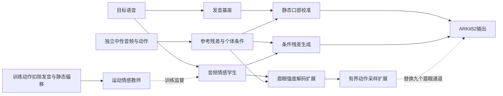

# Methods 以后章节：写作与证据核对

日期：2026-09-22。本文档是作者工作记录，不进入投稿正文。

## 写作提纲

- 方法总览：定义目标音频、独立中性参考、ARKit52 输出及训练和推理的条件边界。
- 参考条件建模：先介绍发音基座，再解释参考残差、跨参考学习及静态口部校准。
- 情感表征迁移：由残差运动构造教师输入，向音频学生迁移全局情感条件，给出输出合成和训练目标。
- 眉眼生成扩展：分开描述参考相对强度解码与真实连续动作采样，不将采样得到的变化称为音频时序重建。
- 实验：数据与划分、实现与指标、已完成的开发实验、消融与失败分析。尚未执行的正式比较放在独立协议中，不填入结果表。
- 讨论与结论：总结目前证据支持的发现，说明参考条件、数据范围及音频局部动态的限制。

## 图与章节对应

这是作者结构草图。正式图需明确两条眉眼路径的替换关系，不能画成所有历史模块串联的最终模型。

## 写作约定

“身份相关风格”指参考所反映的系数偏移和执行习惯，不是几何身份；“发音基座”不是线性口型基；“区域强度”是参考相对系数偏差，不直接等同于感知情感强度。本文只说职责分配，不声称统计独立性。Methods 中的动态扩展对应实际可运行候选，不冒充已替换默认模型。

当前已有结果来自 MEAD 四情感子集。开发集被多轮实验使用；无论本次读取次数是多少，都不能改称独立测试集。冻结上游曾接触全 TRAIN，因此新增模块的逐身份留出不能代表完整系统的未知身份泛化。

## 前文需要作者统一的两处

1. 引言仍含“我想修改为”的编辑备注，且列四条贡献；建议最终采用用户已认可的框架描述，并以“参考残差个体建模”和“残差运动情感迁移”作为另两条待消融支持的贡献。口部保护并入框架，暂不把经验动作采样单列为首创。
2. 引言的 [3] 是 DESTalker，相关工作的 [3] 是 SelfTalk。最终合稿须按同一 BibTeX 引用键重新编号，不能直接拼接现有局部编号。此次从 Methods 起的新增正文尽量使用作者—方法名称及已有引用键，不再制造一套独立数字编号。

## 主要主张与证据

| 主张 | 证据 | 状态 |
|---|---|---|
| 将发音、参考条件和表达分配至不同路径 | 实际 forward 与训练代码 | 结构事实；不等于解耦有效性已证明 |
| 新眉眼路径保持其余43通道 | 组合实现及逐元素保护检查 | 支持结构保护；不支持绝对口型质量 |
| 真实强度可驱动眉眼解码器 | TRAIN 内 calibration 的最终输出强度相关0.77487 | 支持接收能力；不是音频预测性能 |
| 当前音频分支恢复可靠眉眼时序 | full 比 static 的中心化误差更高，输出相关0.06343 | 不支持，正文不作此结论 |
| 连续动作采样改善所测运动分布指标 | 446开发样本、多固定种子ES/VS | 开发性证据；条件检索不全面优于无条件采样 |
| bounded center head 提升泛化 | 原probe的选择和统计协议不足 | 待严格逐身份OOF，不使用probe数字作正式效果证明 |
| 达到MEDTalk水平 | 缺少同数据、同条件比较 | 未建立 |

## 段落反向提纲与五维自查

以下按2026年9月22日初稿的实际段落复核。表中“段落组”合并了公式及其紧邻解释，便于追踪论证，不表示每节只保留一个段落。

### 反向提纲

方法节主旨：通过输入来源、参考统计、训练监督及输出支持域说明不同信息如何进入生成过程；眉眼扩展作为独立候选，不能追认成已经有效的音频时序模型。

| 位置与段落组 | 段落角色与中心句 | 解释/证据及衔接 |
|---|---|---|
| 3.1第1段 | 定义：目标语音与独立中性参考决定生成条件 | 交代52维输出、登记复用、训练/推理边界；身份含义限于统计执行特征 |
| 3.1第2段 | 总览：发音、个体条件和情感分别进入不同路径 | 对应后续3.2–3.4；最后一句引出单列的眉眼扩展 |
| 3.1第3段 | 符号：口部27与眉眼9是不同支持集 | 明确眉眼不含眨眼/视线，掩码与差分规则贯穿方法和指标 |
| 3.2发音基座 | 动机—设计：先预测发音，再构造参考残差 | 式1及冻结关系；基座含情感训练，避免无依据的中性解释 |
| 3.2参考残差 | 设计：每条参考的残差均值/标准差先编码再等权聚合 | 式2–3及跨参考重建/对比约束；不声称残差是纯身份 |
| 3.2口部校准 | 设计：受约束回归替换口部静态偏移 | 式4、身份内/身份间等权；解释为何保留时变发音 |
| 3.3教师 | 动机—设计：剩余运动及其速度提供训练阶段表达监督 | 式5、全局池化和局部条件；说明残差仍可能有混杂 |
| 3.3学生 | 设计—边界：音频学生迁移全局表示并接受生成监督 | 式6；明确四慢状态是辅助监督且不直接合成，不扩大到逐帧蒸馏 |
| 3.4流匹配 | 设计：条件速度场建模非口部归一化残差 | 式7–8，补足等级强度条件与rho尺度 |
| 3.4合成 | 结构性质：先恢复残差尺度再与基座/偏移组合 | 式9推导口部帧差保护；与绝对口型质量区分 |
| 3.4阶段训练 | 实现：各阶段的更新对象和监督不同 | 为实验冻结来源提供上下文，不宣称所有阶段从零共同优化 |
| 3.5强度定义 | 动机—设计：用独立参考坐标描述持续偏移和局部幅度 | 式10、参考片均值的中位数、RMS尺度与五帧均值平滑 |
| 3.5强度预测/解码 | 设计：音频预测两维控制，解码为完整有界眉眼9维 | 式11、离线静态上下文、其余43维旁路、三阶段训练 |
| 3.5连续采样 | 实验设计：以真实连续运动检验分布补充 | 供体排除、原帧率、裁切不重新去均值，避免暗示文本无关排除凭空可做 |
| 3.5有界组合 | 作用与边界：限制输出域，不保证中心或已有动态不变 | 式12；不将经验动作叠加写成严格分解或独立首创 |

实验节主旨：用已有开发实验区分“强度能被执行”“音频能预测局部动态”和“运动先验能补足分布”三个问题；不以接收上限代替音频结果。

| 位置与段落组 | 段落角色与中心句 | 解释/证据及衔接 |
|---|---|---|
| 4.1数据范围 | 设置：MEAD四情感而非全量或跨数据集实验 | 样本数、说话人、句子数、帧率和伪三维标签来源 |
| 4.1模型选择 | 协议：新增模块在训练内分格选择后全TRAIN重训 | 明确上游已见全TRAIN，不滥称完整系统未知身份泛化 |
| 4.1证据范围 | 边界：历史复用的开发集仍是开发集 | 固定种子全部评分，交代未完成的正式证据 |
| 4.2实现 | 复现：网络维度、预算、损失及供体采样规则 | 两种强度网络/先验参数有明确定义；温度选择含回退且属探索性 |
| 4.2中心指标 | 分析设计：将总误差分为均值与中心化部分 | 式13，防止把静态偏移改善说成动态改善 |
| 4.2区域/时序指标 | 因果诊断：从最终输出重提强度，并做局部特征干预 | 静态未定义相关、reverse/mismatch具体作用范围 |
| 4.2分布指标 | 评价补充：ES/VS评价有限样本分布，不替代感知 | 式14及尺度；明确无法与EmoTalk/MEDTalk原指标直接比较 |
| 4.3真实强度 | 上限证据：真实强度能被输出解码器执行 | 校准相关与static/reverse误差，仍非音频预测结果 |
| 4.3音频主表 | 负结果：总误差降低主要来自中心，静态中心化误差更低 | 表1，均值占93.2%，保留完整干预对照 |
| 4.3幅度 | 误差解释：低二阶差分同时伴随显著运动收缩 | 眉眼std及二阶差分实数，不推断平滑即自然 |
| 4.4采样主表 | 发现与取舍：分布评分改善，逐点误差增加 | 表2，各方法使用同一确定性条件及种子面板 |
| 4.4条件收益 | 限定发现：条件检索不全面胜过无条件采样 | ES/VS冲突、协方差退化、均值漂移和wide组不足 |
| 4.4覆盖范围 | 适用范围：当前长度内有供体，长序列未证实 | 供体可重复、最长支持；元数据情感不冒充生成情感 |
| 4.5保护 | 结构证据：新分支只替换眉眼9维 | 其余43维/无效帧保护，不替代基座口型评估 |
| 4.5误差拆解 | 研究指向：中心偏差和低幅局部动态应分开处理 | 连接下一步bounded center研究，而非宣布新方案已成功 |
| 4.5身份范围 | 局限：三个开发身份不足以支持普遍泛化 | 指向逐身份外层留出及核心消融 |

讨论与结论主旨：归纳已支持的能力、反映未完成的验证，不重新提高主张强度。

| 位置 | 段落角色 | 复核结果 |
|---|---|---|
| 5第1段 | 分别解释参考条件、接收器、音频预测和运动先验的证据 | 三种结果不互相替代，主线一致 |
| 5第2段 | 说明口部保护和采样假设带来的功能限制 | 情感嘴角、眨眼/视线/头动、长供体依赖已交代 |
| 5第3段 | 说明伪三维数据及开发协议限制 | 不作同协议性能或广泛未知身份结论 |
| 6第1段 | 总结实际方法和结构设计 | 已删除抽象“职责”堆叠，改写为输入—机制—输出关系 |
| 6第2段 | 总结已观察到的分布改善与尚未解决的问题 | 未加入新数字或未经证实的领先结论 |

### 五维自查

| 维度 | 审稿人问题 | 当前答案与状态 | 投稿前需要的证据/修订 |
|---|---|---|---|
| 贡献 | 读者获得了何种超出常见残差/蒸馏/采样的知识？ | **需新实验。** 信息来源分工、参考残差和全局迁移有明确实现；其相对已有方法的必要性尚未由对应消融证明。经验采样只作基线。 | 固定三条主张，补参考原动作对照、无教师/分类监督对照、口部保护取舍；与相关工作的输入和机制作具体比较 |
| 写作清晰度 | 读者能否沿公式重建输入、尺度、支持域和训练流程？ | **已修订，仍需整稿统一。** 修正anchor中位数、口部偏移替换、rho恢复、等级强度条件、离线输入和采样边界；式14不再用K同时表示参考数与采样数。 | 合稿统一引用编号，按最终模型补训练预算表和方法图；正式图标清基础路径与两种独立扩展 |
| 实验强度 | 效果是否足以支持方法优势或竞争性？ | **需新实验。** 真实强度接收有效；音频时序仍弱；ES/VS改善但MSE和协方差退化。不能由此认定达到EmoTalk/MEDTalk水平。 | 有界中心的严格新增模块OOF、同协议外部基线、分情感/身份统计；根据结果决定扩展是否进入最终主方法 |
| 评价完整性 | 是否证明了三条贡献、口型、生成情感和感知自然度？ | **需新实验。** 现稿仅有开发性输出误差、局部干预和分布评分。尚无统一外部主表、关键消融、独立生成情感/身份评价或主观研究。 | 按正式实验协议补齐；不能将冻结音频分类准确率或供体标签一致率作为生成脸情感指标 |
| 方法合理性 | 部署假设和评价是否隐藏了目标信息或泄漏？ | **部分通过，边界保留。** 学生/解码器不读目标动作；采样库仅训练数据；开发集重复使用、上游见过全TRAIN、语句ID排除、供体长度和组合均值变化均已披露。 | 逐折重估新模块统计，含零更新回退及全TRAIN重训；整个系统未知身份主张需重训上游；最终应用需说明无法取得语句标识时的供体策略 |

本轮明确技术修订均可映射至 `03_方法代码核对_20260922.md`、`docs/REFERENCE_INTENSITY_DECODER_20260922.md` 和 `docs/EMPIRICAL_UPPER_MOTION_20260922.md`。不新增结果、不改训练代码、不修改引言和摘要原稿。

### 尚未消除的拒稿风险

当前章节已形成可读的方法与开发实验底稿，但主实验尚未覆盖论文核心贡献。增加学术措辞、章节或贡献编号无法替代这部分证据。优先完成既定中心OOF和同协议核心消融，再决定最终主方法及摘要的效果陈述。引用能量分数、变差分数及流匹配的原始来源时，还需补充真实核查的文献，不能仅凭公式正确而省略方法出处。

本文档记录可核对的自查，不构成独立审稿或录用保证。
